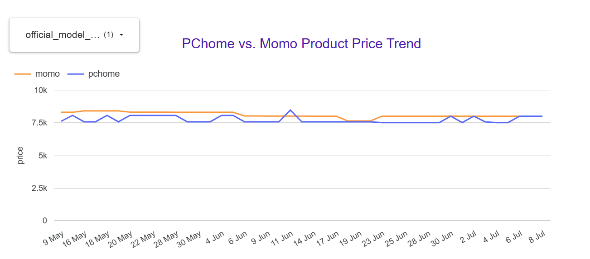
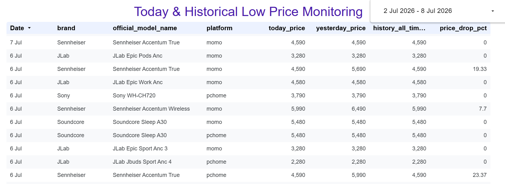
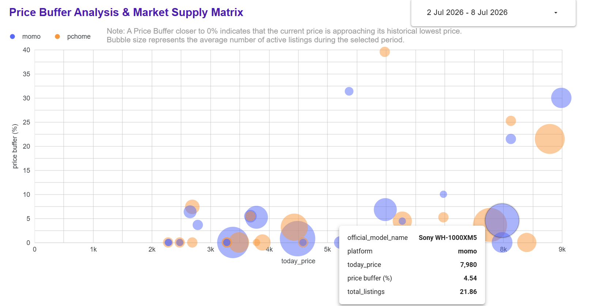
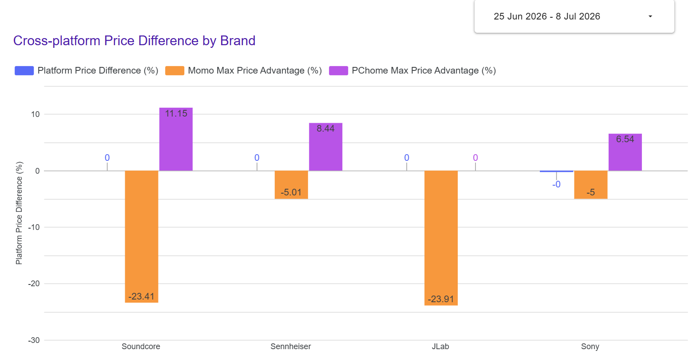

# Dashboard Walkthrough

This page presents the key dashboards built on the Mart layer.

---

## 📈 Product Price Trend

Tracks daily price movements across momo and PChome.

---

## 🏷️ Historical Low Price Monitoring

Identifies products whose current price is equal to or lower than the historical lowest price.

---

## 📊 Price Buffer Analysis & Market Supply Matrix

Measures how far the current price is from its historical lowest price, with bubble size representing the average number of active listings.

---

## ⚖️ Cross-platform Price Difference by Brand

Shows the median price gap between momo and PChome, together with each platform's maximum price advantage during the selected period.

